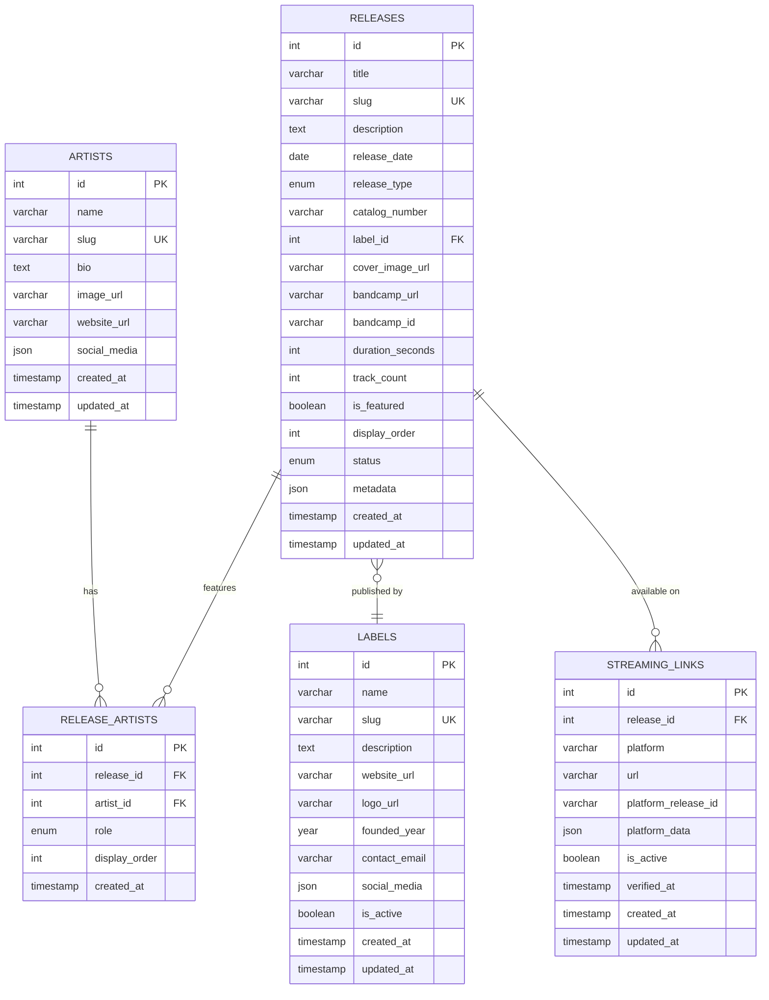

# Database Schema Documentation

## Overview

This document provides comprehensive documentation for the All Day Every Day Records database schema. The database is designed to support a music release management platform with artists, labels, releases, and streaming platform integration.

## Design Philosophy

### Normalization Strategy
- **3rd Normal Form (3NF)**: Core entities are normalized to eliminate redundancy
- **Strategic Denormalization**: JSON fields for flexible metadata without schema changes
- **Performance Balance**: Normalized for data integrity, denormalized where performance requires

### Key Design Principles
1. **Data Integrity**: Foreign key constraints and triggers ensure consistent data
2. **Performance**: Strategic indexing for common query patterns
3. **Flexibility**: JSON fields for evolving metadata requirements
4. **Scalability**: Schema designed to handle growth in data volume
5. **Unicode Support**: Full UTF8MB4 support for international content

## Entity Relationship Diagram



## Table Specifications

### Artists Table

**Purpose**: Stores information about music artists, DJs, and producers.

| Column | Type | Constraints | Description |
|--------|------|------------|-------------|
| id | INT UNSIGNED | PRIMARY KEY, AUTO_INCREMENT | Unique identifier |
| name | VARCHAR(255) | NOT NULL | Artist or group name |
| slug | VARCHAR(255) | UNIQUE, NOT NULL | URL-friendly identifier |
| bio | TEXT | NULL | Artist biography/description |
| image_url | VARCHAR(500) | NULL | Artist profile image URL |
| website_url | VARCHAR(500) | NULL | Official website URL |
| social_media | JSON | NULL | Social media links object |
| created_at | TIMESTAMP | DEFAULT CURRENT_TIMESTAMP | Creation timestamp |
| updated_at | TIMESTAMP | ON UPDATE CURRENT_TIMESTAMP | Last update timestamp |

**Indexes:**
- `idx_slug` (slug) - Unique identifier lookups
- `idx_name` (name) - Artist name searches
- `idx_created_at` (created_at) - Chronological ordering

**Social Media JSON Structure:**
```json
{
  "instagram": "https://instagram.com/username",
  "twitter": "https://twitter.com/username", 
  "facebook": "https://facebook.com/username",
  "soundcloud": "https://soundcloud.com/username",
  "bandcamp": "https://username.bandcamp.com"
}
```

### Labels Table

**Purpose**: Stores record label information and metadata.

| Column | Type | Constraints | Description |
|--------|------|------------|-------------|
| id | INT UNSIGNED | PRIMARY KEY, AUTO_INCREMENT | Unique identifier |
| name | VARCHAR(255) | NOT NULL | Label name |
| slug | VARCHAR(255) | UNIQUE, NOT NULL | URL-friendly identifier |
| description | TEXT | NULL | Label description |
| website_url | VARCHAR(500) | NULL | Official label website |
| logo_url | VARCHAR(500) | NULL | Label logo image URL |
| founded_year | YEAR | NULL | Year the label was founded |
| contact_email | VARCHAR(255) | NULL | Label contact email |
| social_media | JSON | NULL | Social media links object |
| is_active | BOOLEAN | DEFAULT TRUE | Whether label is currently active |
| created_at | TIMESTAMP | DEFAULT CURRENT_TIMESTAMP | Creation timestamp |
| updated_at | TIMESTAMP | ON UPDATE CURRENT_TIMESTAMP | Last update timestamp |

**Indexes:**
- `idx_slug` (slug) - Unique identifier lookups
- `idx_name` (name) - Label name searches  
- `idx_is_active` (is_active) - Active label filtering
- `idx_founded_year` (founded_year) - Historical queries

### Releases Table

**Purpose**: Main table for music releases (singles, EPs, albums, etc.).

| Column | Type | Constraints | Description |
|--------|------|------------|-------------|
| id | INT UNSIGNED | PRIMARY KEY, AUTO_INCREMENT | Unique identifier |
| title | VARCHAR(255) | NOT NULL | Release title |
| slug | VARCHAR(255) | UNIQUE, NOT NULL | URL-friendly identifier |
| description | TEXT | NULL | Release description/notes |
| release_date | DATE | NULL | Official release date |
| release_type | ENUM | NOT NULL, DEFAULT 'single' | Type of release |
| catalog_number | VARCHAR(100) | NULL | Label catalog number |
| label_id | INT UNSIGNED | FOREIGN KEY | Associated record label |
| cover_image_url | VARCHAR(500) | NULL | Release cover art URL |
| bandcamp_url | VARCHAR(500) | NULL | Bandcamp release URL |
| bandcamp_id | VARCHAR(100) | NULL | Bandcamp release ID |
| duration_seconds | INT UNSIGNED | NULL | Total duration in seconds |
| track_count | INT UNSIGNED | DEFAULT 1 | Number of tracks |
| is_featured | BOOLEAN | DEFAULT FALSE | Featured on homepage |
| display_order | INT | DEFAULT 0 | Order for display sorting |
| status | ENUM | DEFAULT 'published' | Publication status |
| metadata | JSON | NULL | Additional metadata |
| created_at | TIMESTAMP | DEFAULT CURRENT_TIMESTAMP | Creation timestamp |
| updated_at | TIMESTAMP | ON UPDATE CURRENT_TIMESTAMP | Last update timestamp |

**Enums:**
- `release_type`: 'single', 'ep', 'album', 'compilation', 'mixtape', 'remix'
- `status`: 'draft', 'published', 'archived'

**Foreign Keys:**
- `label_id` → `labels(id)` (ON DELETE SET NULL, ON UPDATE CASCADE)

**Indexes:**
- `idx_slug` (slug) - Unique identifier lookups
- `idx_release_date` (release_date) - Date-based queries
- `idx_release_type` (release_type) - Type-based filtering
- `idx_label_id` (label_id) - Label association queries
- `idx_is_featured` (is_featured) - Featured content queries
- `idx_status` (status) - Status-based filtering
- `idx_display_order` (display_order) - Ordered listings
- `idx_status_featured` (status, is_featured) - Homepage queries
- `idx_status_date` (status, release_date) - Published releases by date
- `idx_type_status` (release_type, status) - Type and status queries

**Metadata JSON Structure:**
```json
{
  "genres": ["Electronic", "House"],
  "moods": ["Energetic", "Uplifting"],
  "bpm": 128,
  "key": "C major",
  "mastered_by": "Engineer Name",
  "recorded_at": "Studio Name",
  "explicit": false,
  "isrc": "USRC17607839"
}
```

### Release_Artists Table

**Purpose**: Many-to-many relationship between releases and artists with roles.

| Column | Type | Constraints | Description |
|--------|------|------------|-------------|
| id | INT UNSIGNED | PRIMARY KEY, AUTO_INCREMENT | Unique identifier |
| release_id | INT UNSIGNED | FOREIGN KEY, NOT NULL | Release reference |
| artist_id | INT UNSIGNED | FOREIGN KEY, NOT NULL | Artist reference |
| role | ENUM | DEFAULT 'primary' | Artist role on release |
| display_order | INT | DEFAULT 0 | Order for display purposes |
| created_at | TIMESTAMP | DEFAULT CURRENT_TIMESTAMP | Creation timestamp |

**Enums:**
- `role`: 'primary', 'featured', 'remixer', 'producer', 'collaborator'

**Foreign Keys:**
- `release_id` → `releases(id)` (ON DELETE CASCADE, ON UPDATE CASCADE)
- `artist_id` → `artists(id)` (ON DELETE CASCADE, ON UPDATE CASCADE)

**Constraints:**
- `unique_release_artist_role` (release_id, artist_id, role) - Prevents duplicate role assignments

**Indexes:**
- `idx_release_id` (release_id) - Release-to-artists queries
- `idx_artist_id` (artist_id) - Artist-to-releases queries
- `idx_role` (role) - Role-based filtering
- `idx_display_order` (display_order) - Ordered artist listings

### Streaming_Links Table

**Purpose**: Stores streaming platform URLs and metadata for releases.

| Column | Type | Constraints | Description |
|--------|------|------------|-------------|
| id | INT UNSIGNED | PRIMARY KEY, AUTO_INCREMENT | Unique identifier |
| release_id | INT UNSIGNED | FOREIGN KEY, NOT NULL | Release reference |
| platform | VARCHAR(50) | NOT NULL | Streaming platform name |
| url | VARCHAR(500) | NOT NULL | Platform-specific URL |
| platform_release_id | VARCHAR(255) | NULL | Platform internal ID |
| platform_data | JSON | NULL | Platform-specific metadata |
| is_active | BOOLEAN | DEFAULT TRUE | Whether link is active |
| verified_at | TIMESTAMP | NULL | Last verification timestamp |
| created_at | TIMESTAMP | DEFAULT CURRENT_TIMESTAMP | Creation timestamp |
| updated_at | TIMESTAMP | ON UPDATE CURRENT_TIMESTAMP | Last update timestamp |

**Foreign Keys:**
- `release_id` → `releases(id)` (ON DELETE CASCADE, ON UPDATE CASCADE)

**Indexes:**
- `idx_release_id` (release_id) - Release-to-platforms queries
- `idx_platform` (platform) - Platform-specific queries
- `idx_is_active` (is_active) - Active link filtering
- `idx_verified_at` (verified_at) - Verification status queries
- `idx_release_platform` (release_id, platform) - Release-platform combinations
- `idx_platform_active` (platform, is_active) - Active platform links

**Platform Data JSON Structure:**
```json
{
  "artwork_url": "https://platform.com/artwork.jpg",
  "embed_url": "https://platform.com/embed/12345",
  "track_id": "12345",
  "duration": 240,
  "play_count": 1500,
  "last_updated": "2025-01-01T00:00:00Z"
}
```

## Database Views

### Release_Overview View

**Purpose**: Consolidated view of releases with denormalized data for performance.

```sql
CREATE VIEW release_overview AS
SELECT 
    r.id,
    r.title,
    r.slug,
    r.description,
    r.release_date,
    r.release_type,
    r.catalog_number,
    r.cover_image_url,
    r.bandcamp_url,
    r.duration_seconds,
    r.track_count,
    r.is_featured,
    r.display_order,
    r.status,
    r.created_at,
    r.updated_at,
    l.name as label_name,
    l.slug as label_slug,
    GROUP_CONCAT(
        DISTINCT CONCAT(a.name, ':', ra.role)
        ORDER BY ra.display_order, ra.role
        SEPARATOR '|'
    ) as artists_with_roles,
    GROUP_CONCAT(
        DISTINCT sl.platform
        ORDER BY sl.platform
        SEPARATOR ','
    ) as available_platforms
FROM releases r
LEFT JOIN labels l ON r.label_id = l.id
LEFT JOIN release_artists ra ON r.id = ra.release_id
LEFT JOIN artists a ON ra.artist_id = a.id
LEFT JOIN streaming_links sl ON r.id = sl.release_id AND sl.is_active = TRUE
WHERE r.status = 'published'
GROUP BY r.id;
```

**Usage:**
```sql
-- Get homepage releases
SELECT * FROM release_overview 
WHERE is_featured = TRUE 
ORDER BY display_order;

-- Get recent releases
SELECT * FROM release_overview 
ORDER BY release_date DESC 
LIMIT 10;
```

## Stored Procedures

### GetReleaseDetails(release_slug)

**Purpose**: Returns complete release information with related data.

```sql
CALL GetReleaseDetails('release-slug-name');
```

**Returns**: Three result sets:
1. Release information with label details
2. Artists with roles and display order
3. Active streaming links

## Data Validation and Triggers

### Release Data Validation Trigger

**Purpose**: Ensures data consistency for release records.

```sql
CREATE TRIGGER validate_release_data
BEFORE INSERT ON releases
FOR EACH ROW
BEGIN
    -- Ensure slug is lowercase and URL-safe
    SET NEW.slug = LOWER(REPLACE(REPLACE(NEW.slug, ' ', '-'), '_', '-'));
    
    -- Set default display_order for featured releases
    IF NEW.display_order = 0 AND NEW.is_featured = TRUE THEN
        SET NEW.display_order = (
            SELECT COALESCE(MAX(display_order), 0) + 10 
            FROM releases 
            WHERE is_featured = TRUE
        );
    END IF;
END;
```

## Query Patterns and Examples

### Common Query Patterns

#### 1. Release Listing with Pagination
```sql
-- Get published releases with pagination
SELECT r.*, l.name as label_name
FROM releases r
LEFT JOIN labels l ON r.label_id = l.id
WHERE r.status = 'published'
ORDER BY r.release_date DESC
LIMIT 20 OFFSET 0;
```

#### 2. Artist Discography
```sql
-- Get all releases by an artist
SELECT r.*, ra.role
FROM releases r
JOIN release_artists ra ON r.id = ra.release_id
WHERE ra.artist_id = ? 
  AND r.status = 'published'
ORDER BY r.release_date DESC;
```

#### 3. Label Catalog
```sql
-- Get all releases from a label
SELECT r.*
FROM releases r
JOIN labels l ON r.label_id = l.id
WHERE l.slug = ?
  AND r.status = 'published'
ORDER BY r.release_date DESC;
```

#### 4. Featured Content
```sql
-- Get homepage featured releases
SELECT * FROM release_overview
WHERE is_featured = TRUE
ORDER BY display_order, release_date DESC;
```

#### 5. Release with Full Details
```sql
-- Get release with all related data
SELECT 
    r.*,
    l.name as label_name,
    GROUP_CONCAT(CONCAT(a.name, ':', ra.role)) as artists,
    GROUP_CONCAT(sl.platform, ':', sl.url) as streaming_links
FROM releases r
LEFT JOIN labels l ON r.label_id = l.id
LEFT JOIN release_artists ra ON r.id = ra.release_id
LEFT JOIN artists a ON ra.artist_id = a.id
LEFT JOIN streaming_links sl ON r.id = sl.release_id AND sl.is_active = TRUE
WHERE r.slug = ?
GROUP BY r.id;
```

### Search Queries

#### 1. Release Search
```sql
-- Search releases by title
SELECT * FROM release_overview
WHERE title LIKE CONCAT('%', ?, '%')
  AND status = 'published'
ORDER BY release_date DESC;
```

#### 2. Artist Search
```sql
-- Search artists by name
SELECT * FROM artists
WHERE name LIKE CONCAT('%', ?, '%')
ORDER BY name;
```

#### 3. Advanced Search
```sql
-- Search across releases and artists
SELECT DISTINCT r.*
FROM releases r
LEFT JOIN release_artists ra ON r.id = ra.release_id
LEFT JOIN artists a ON ra.artist_id = a.id
WHERE (r.title LIKE CONCAT('%', ?, '%')
   OR a.name LIKE CONCAT('%', ?, '%'))
  AND r.status = 'published'
ORDER BY r.release_date DESC;
```

## Performance Optimization

### Index Usage Guidelines

1. **Use WHERE clauses that match indexes**:
```sql
-- Good: Uses status index
WHERE status = 'published'

-- Good: Uses composite index
WHERE status = 'published' AND is_featured = TRUE
```

2. **Avoid function calls on indexed columns**:
```sql
-- Bad: Cannot use index
WHERE YEAR(release_date) = 2025

-- Good: Can use index
WHERE release_date >= '2025-01-01' AND release_date < '2026-01-01'
```

3. **Order by indexed columns**:
```sql
-- Good: Uses index for sorting
ORDER BY release_date DESC

-- Consider composite index for:
ORDER BY status, release_date DESC
```

### Query Optimization Tips

1. **Use EXPLAIN to analyze queries**:
```sql
EXPLAIN SELECT * FROM releases WHERE status = 'published';
```

2. **Limit result sets**:
```sql
SELECT * FROM releases ORDER BY release_date DESC LIMIT 20;
```

3. **Use specific column lists**:
```sql
-- Instead of SELECT *
SELECT id, title, slug, release_date FROM releases;
```

4. **Use prepared statements**:
```php
$stmt = $pdo->prepare("SELECT * FROM releases WHERE slug = ?");
$stmt->execute([$slug]);
```

## Migration Strategy

### Migration File Naming Convention
```
YYYY_MM_DD_HHMMSS_description.sql
```

Example: `2025_01_01_000001_create_artists_table.sql`

### Migration Process
1. Create migration file in `backend/database/migrations/`
2. Test on development database
3. Review with team
4. Apply to staging environment
5. Deploy to production with rollback plan

### Rollback Strategy
- Each migration includes both UP and DOWN operations
- Migrations are tracked in `migrations` table
- Rollback executes DOWN operations in reverse order

## Security Considerations

### Data Protection
- All user input must be sanitized and validated
- Use prepared statements to prevent SQL injection
- Implement proper access controls at database level
- Regular security updates for database server

### Access Control
- Application database user with minimal required privileges
- Separate read-only user for reporting and analytics
- Administrative access limited to database administrators

### Data Validation
- Foreign key constraints prevent data inconsistencies
- Triggers validate data format and business rules
- ENUM constraints ensure valid status values
- NOT NULL constraints prevent missing required data

## Backup and Recovery

### Backup Strategy
```bash
# Full backup
mysqldump -u username -p --single-transaction --routines --triggers database_name > backup_$(date +%Y%m%d_%H%M%S).sql

# Schema only
mysqldump -u username -p --no-data database_name > schema_backup.sql

# Data only  
mysqldump -u username -p --no-create-info database_name > data_backup.sql
```

### Recovery Procedures
```bash
# Full restore
mysql -u username -p database_name < backup_file.sql

# Schema only restore
mysql -u username -p database_name < schema_backup.sql
```

### Backup Schedule
- **Daily**: Automated full backup
- **Weekly**: Verified backup restore test
- **Monthly**: Archive backup to offsite storage

## Future Enhancements

### Planned Features
1. **Full-text search** indexes for improved search performance
2. **Audit logging** for data change tracking
3. **Soft deletes** for data recovery capabilities
4. **Partitioning** by date for large datasets
5. **Read replicas** for improved query performance

### Scalability Considerations
1. **Horizontal partitioning** by release date ranges
2. **Caching layer** with Redis for frequently accessed data
3. **Connection pooling** for high concurrent usage
4. **Query result caching** for expensive aggregation queries

This schema provides a robust foundation for the All Day Every Day Records platform while maintaining flexibility for future growth and enhancements.